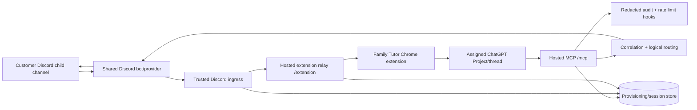
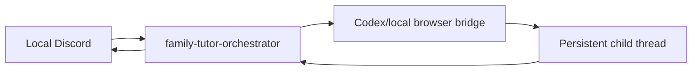

# Architecture

Family Tutor has one hosted commercial product path for customer families. The
local tutor runtime under `skills/family-tutor/runtime/` remains a development
and dogfood compatibility path; customer traffic does not depend on it.

## Hosted product flow

The exact turn is:

1. The shared Discord provider receives a message containing a trusted provider
   channel id.
2. `receiveTrusted()` maps that provider id to exactly one active logical
   family/child. Ambiguous or unknown provider bindings are rejected.
3. The hosted extension relay sends an opaque correlation and turn to the
   authenticated extension socket for that exact family/child.
4. The extension injects the turn into the child’s assigned ChatGPT Project.
5. ChatGPT uses the hosted Family Tutor MCP tool `reply_to_discord` with the
   opaque correlation id. It never receives or chooses a Discord channel id.
6. The server verifies that the MCP family/child session owns that correlation,
   then sends the reply to the original provider channel stored in trusted
   server state.

The same hosted MCP also exposes logical outbound tools such as
`send_tutor_message`. Those resolve `{type,key}` through the authenticated
family session before touching a provider id.

## Product composition

`createFamilyTutorProduct()` in `packages/integration/src/index.mjs` is the
canonical composition. It wires:

- family/child provisioning and session identity;
- the shared Discord adapter and trusted ingress;
- hosted MCP authentication, entitlements and tools;
- the hosted extension WebSocket relay;
- child-to-ChatGPT-Project readiness;
- onboarding and acceptance state;
- export/delete/revocation lifecycle controls;
- `/healthz`, `/readyz`, `/mcp`, and `/extension` on one hosted process.

`npm run start:product` starts `packages/integration/src/server.mjs`. Production
supplies `FAMILY_TUTOR_PROVIDER_MODULE`, whose provider implements
`send({channelId, content, metadata})` and may implement `start({onMessage})`
for Discord ingress plus `close()` for shutdown. Provider credentials remain in
the deployment secret manager.

The extension accepts either the legacy local `ws://127.0.0.1/...` bridge or the
hosted `wss://family-tutor.qili2.com/extension` endpoint. Hosted mode authenticates
after WebSocket connection with a scoped family session token kept in Chrome
extension storage; tokens are not placed in URLs.

## Safety boundaries

The central invariant is:

> authenticate identity, authorize scope, resolve a logical or trusted
> correlation boundary, then touch a provider id.

Model-facing MCP input cannot supply `familyId`, raw Discord/provider channel IDs, `providerId`, or
other tenant selectors. Opaque Family Tutor channel handles may appear only in
explicit `@name(channelId=...)` target mentions. Product status and exports redact provider ids and token
hashes. The extension relay accepts only authenticated family sessions and binds
children that already belong to that family.

## Local dogfood path

The legacy/local path is still useful for the current family and development:

This path is not the commercial hosted architecture and must not become a
fallback for an external family. Real local-family state stays under ignored
`runs/family/`.
