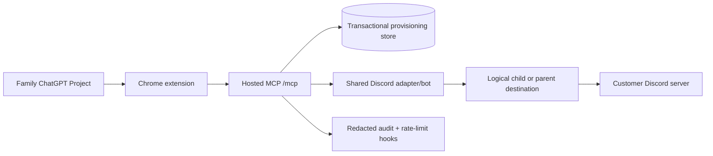
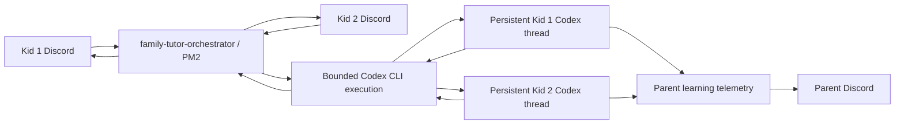

# Architecture

Family Tutor has two related but separate runtime surfaces: a shared hosted
commercial service for customer families, and the reusable local tutor runtime
used for development/dogfooding. Customer traffic must not fall back to an
arbitrary local instance.

The hosted path authenticates a family session, checks scope and entitlement,
accepts only logical destinations, resolves provider bindings inside trusted
adapters, and records metadata without child content. `/healthz` is liveness;
`/readyz` is dependency readiness; `/mcp` is authenticated application traffic.

The local tutoring path remains useful for the operator and for the existing
family runtime:

The reusable implementation lives in `skills/family-tutor`; each real local
family instance lives under ignored `runs/family/`. Hosted provisioning state
must use a transactional store for multi-process deployments. The included JSON
store is suitable for one-process rehearsals only.
