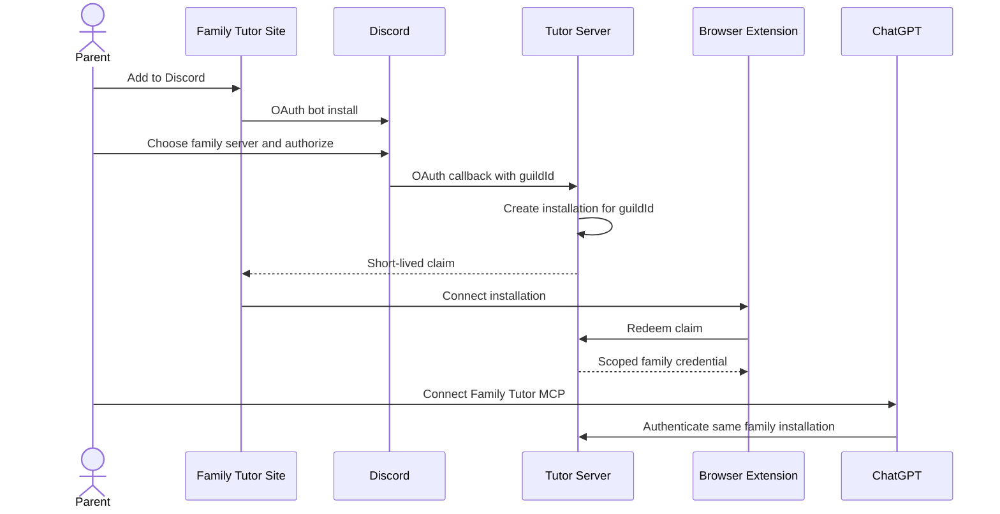
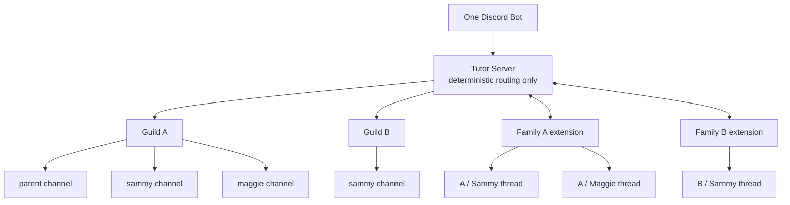
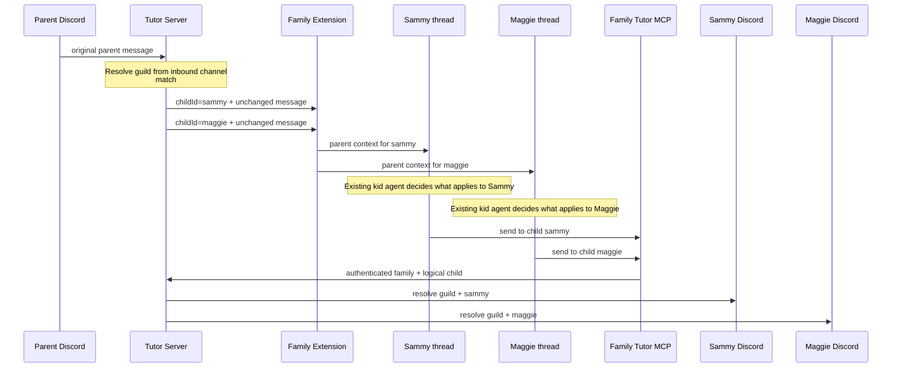
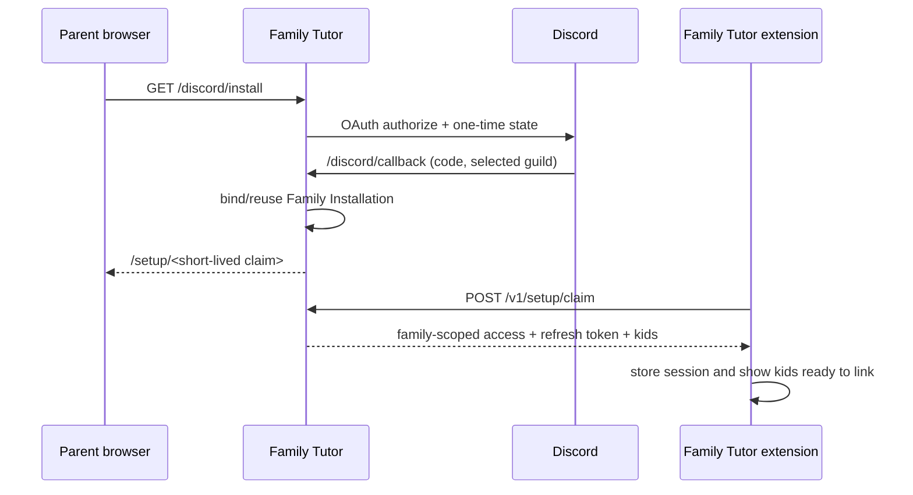

# Family installation and routing

Family Tutor uses **one hosted Discord bot and MCP service for many families**. There is no parent/router agent. The only intelligent agents are each child's persistent ChatGPT thread.

## Identity

- `guildId` is the Discord family/tenant identity.
- A family installation credential authenticates the extension/MCP to that guild. It is random, never derived from `guildId`; the server stores only its hash.
- `guildId + childId` identifies a child destination within a family.
- `correlationId` is temporary reply plumbing for one inbound Discord event. It is **not** family context or identity.
- The Tutor Server owns Discord destination bindings. The extension owns `childId -> active ChatGPT thread` bindings.

## Installation



The customer never types or sees a guild ID or long-lived family credential.

## Runtime topology



A child name is never globally unique. `Guild A + sammy` and `Guild B + sammy` are isolated routes.

## Parent multi-child message

For `ask #sammy to do homework, and #maggie to draw poster`, the server performs only configured `#name` matching. It does **not** interpret or split the natural-language instruction.



## Context versus delivery

`FAMILY_TUTOR_CONTEXT` contains semantic data only:

```json
{"type":"parent","data":{"sender":{"channelId":"parents","name":"Parents"},"message":"remind @sammy(channelId=sammy) to do homework","attachments":[]}}
```

The same unchanged parent message is delivered to every explicitly mentioned child's thread. Each thread interprets only its own part.

```text
correlationId -> exact inbound Discord event -> reply to source
guildId + childId -> configured child Discord channel -> send to child
childId -> extension activeThreadId -> deliver to ChatGPT
```

This keeps the backend deterministic: **one intelligent agent per child; transport does not become another agent.**


## Automatic family browser claim

The public install CTA now starts at `/discord/install` rather than embedding a raw Discord authorization URL. The hosted Family Tutor service creates a short-lived OAuth state, sends the parent to Discord, and accepts the Discord callback only once. The callback binds the selected Discord server to the local Family Installation without exposing the Discord server ID to the browser UI or model-facing APIs.



Security properties:
- setup claims are random, short-lived, and single-use; only their hash is held in memory while pending;
- the durable installation stores an opaque `familyId` plus a keyed hash of the Discord guild ID, not the raw guild ID;
- extension access and refresh tokens carry the Family Installation scope and are rejected by a different installation;
- reinstalling the same Discord server reuses the Family Installation, while attempting to bind a different server to the same per-family runtime is rejected;
- ChatGPT MCP pairing remains a separate step and is intentionally not changed by this flow.


## Voice messages

Discord voice/audio attachments are not forwarded to ChatGPT as files. The runtime first transcribes them with the hosted `family-tutor-asr` Cloudflare Worker using Workers AI `whisper-large-v3-turbo`, removes the audio attachment, and appends the transcript to `data.message` inside the typed context. Requests are signed with a local P-256 private key; the Worker stores only the corresponding public key. Other attachment types continue to pass through unchanged. Local MLX Whisper remains an optional development/offline fallback.
